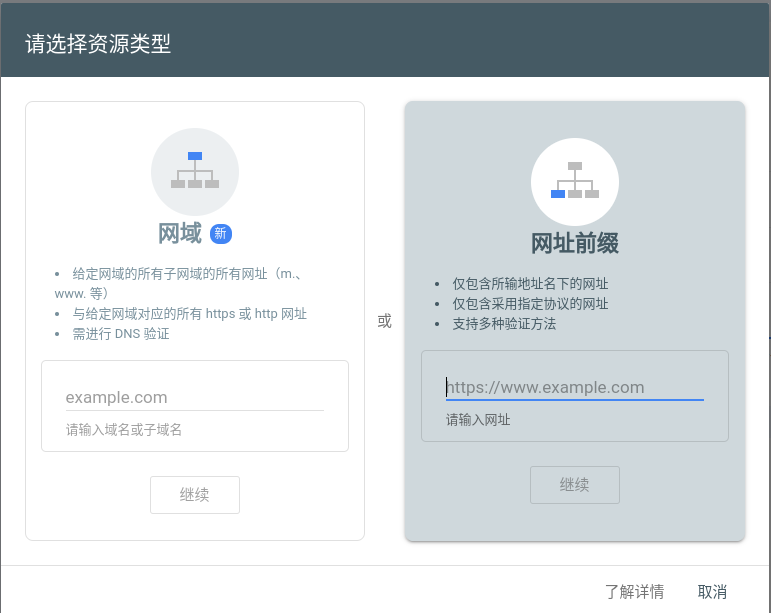

## 1. 创建 github 仓库

首先在 github 上创建一个仓库，仓库名必须是形如`<用户名>.github.io`，
在项目都设置中找到`pages`选项

## 2. 安装 hexo

执行如下命令安装`hexo`，如果没有安装`npm`，需要先安装`npm`，读者根据各自的发行版进行安装。

```bash
npm install -g hexo-cli
```

安装好`hexo`后，执行如下命令生成一个初始项目

```bash
hexo init <folder>
cd <folder>
npm install
```

## 3. 生成博客

初始项目中只有主页和一个博客，执行如下命令可以查看该初始博客

```bash
hexo clean # 清空博客
hexo g # 生成博客
hexo s # 调试博客
```

执行`hexo s`后，在浏览器中输入`http://localhost:4000/`，可以查看该初始博客。

## 4. 配置博客

博客的配置文件是`_config.yml`,

```yaml
theme: next

deploy:
    type: git
    repo: git@github.com:user-name/user-name.github.io.git
    branch: main

excerpt:
    depth: 3
    excerpt_excludes: []
    more_excludes: []
    hideWholePostExcerpts: true
```

### 4.1 theme 主题

其中`theme`配置主题，这里使用都`next`主题，该主题不是自带的，需要执行如下命令进行安装

```bash
git clone https://github.com/theme-next/hexo-theme-next themes/next
```

### 4.2 deploy 部署

先安装扩展`npm install hexo-deployer-git`

`deploy`配置部署的相关配置，其中的

1. `type`: 声明部署类型
2. `repo`: 声明远程地址
3. `branch`: 声明分支名

### 4.3. excerpt 首页内容隐藏

先安装扩展`npm install hexo-excerpt`

1. `depth`: 深度，可以理解为行

## 5. hexo 常用命令

1. `hexo clean`: 清空生成的博客
2. `hexo g`: 生成博客
3. `hexo s`: 开启本地服务(localhost:4000)，查看博客
4. `hexo d`: 部署博客，上传到 git 仓库中

## 6. 让 Google 收录本博客

### 6.1 网站验证

访问 [Google Search Console](https://search.google.com/search-console) 网站，选择添加资源，在弹窗中**网络前缀**



在**网络前缀**中填入你的博客地址，之后 [Google Search Console](https://search.google.com/search-console) 会验证你是否是该网页的所有者。
它会提供几种验证方法，这里选择在主页中添加 html 文件进行验证，将他提供的 html 文件下载下来，将其放到主页的根目录下。

针对 hexo 搭建的博客，由于 public 中的页面都是动态生成的，没法直接放进去，这里我采用了曲线救国的方式：将该文件放到 theme 主题中，具体位置是：`themes/next/source/googlexxxxx.xml`，之后重新生成博客即可。

### 6.2 添加站点地图

如果只做上面的操作 Google Search 中还是没有咱们的网站，咱们需要生成网站的索引，并比较给 Google，这里使用 [xml-sitemaps](https://www.xml-sitemaps.com/) 这个网站生成 `sitemap.xml`，具体过程就不赘述了，网站引导做的挺好。
下载下来的 `sitemap.xml` 和 `googlexxxx.xml` 一样，放到 `themes/next/source/` 目录下，并生成行博客。
之后在 [Google Search Console](https://search.google.com/search-console) 中的**站点地图**中填入 `sitemap.xml` 文件即可，之后等待 Google 收录即可，大概需要 1 天。
