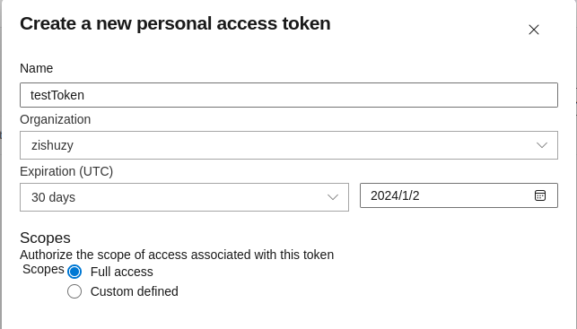
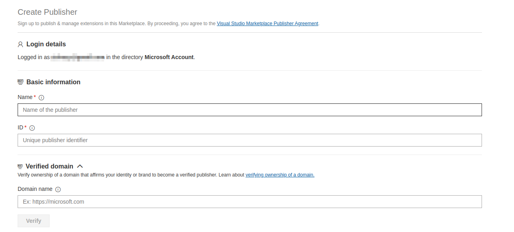

## 1 准备开发环境

开发环境是 Node.js 所以咱们需要安装该环境，至于 Node.js 如何安装这里就不详细说了，我的环境是 manjaro 这里使用如下命令进行安装

```shell
sudo pacman install npm
```

安装好 Node.js 环境后，就需要安装 vscode 插件的脚手架了。

```shell
npm install -g yo generator-code
```

安装好之后，就可以创建一个插件项目了，根据提示选择开发模板等信息，我这里选择的 `TypeScipt` 语言。

```shell
# 创建一个 helloword 插件
> yo code helloword
    _-----_     ╭──────────────────────────╮
   |       |    │   Welcome to the Visual  │
   |--(o)--|    │   Studio Code Extension  │
  `---------´   │        generator!        │
   ( _´U`_ )    ╰──────────────────────────╯
   /___A___\   /
    |  ~  |      
  __'.___.'__    
´   `  |° ´ Y `  

? What type of extension do you want to create? New Extension (TypeScript)
? What's the name of your extension? helloword
? What's the identifier of your extension? helloword
? What's the description of your extension? This is helloword
? Initialize a git repository? Yes
? Bundle the source code with webpack? No
? Which package manager to use? npm
```

## 2 准备开发

项目结构

```shell
helloword
├── CHANGELOG.md    # 发布日志文件
├── node_modules    # 依赖的模块
├── package.json    # 配置文件
├── package-lock.json
├── README.md
├── src
│   ├── extension.ts    # 主程序入口
│   └── test
├── tsconfig.json
└── vsc-extension-quickstart.md
```

`extension.ts` 文件

```ts
// The module 'vscode' contains the VS Code extensibility API
// Import the module and reference it with the alias vscode in your code below
import * as vscode from "vscode";

// this method is called when your extension is activated
// your extension is activated the very first time the command is executed
export function activate(context: vscode.ExtensionContext) {
    // Use the console to output diagnostic information (console.log) and errors (console.error)
    // This line of code will only be executed once when your extension is activated
    console.log('Congratulations, your extension "helloword" is now active!');

    // The command has been defined in the package.json file
    // Now provide the implementation of the command with registerCommand
    // The commandId parameter must match the command field in package.json
    let disposable = vscode.commands.registerCommand(
        "helloword.helloWorld",
        () => {
            // The code you place here will be executed every time your command is executed
            // Display a message box to the user
            vscode.window.showInformationMessage("Hello World from helloword!");
        }
    );

    context.subscriptions.push(disposable);
}

// this method is called when your extension is deactivated
export function deactivate() {}
```

`package.json` 文件

```json
{
    "name": "helloword",
    "displayName": "helloword",
    "description": "This is helloword",
    "version": "0.0.1",
    "engines": {
        "vscode": "^1.84.0"
    },
    "categories": ["Other"],
    "activationEvents": ["onCommand:helloword.helloWorld"],
    "main": "./out/extension.js",
    "contributes": {
        "commands": [
            {
                "command": "helloword.helloWorld",
                "title": "Hello World"
            }
        ]
    },
    "scripts": {
        "vscode:prepublish": "npm run compile",
        "compile": "tsc -p ./",
        "watch": "tsc -watch -p ./",
        "pretest": "npm run compile && npm run lint",
        "lint": "eslint src --ext ts",
        "test": "node ./out/test/runTest.js"
    },
    "devDependencies": {
        "@types/vscode": "^1.84.0",
        "@types/glob": "^7.2.0",
        "@types/mocha": "^9.1.1",
        "@types/node": "16.x",
        "@typescript-eslint/eslint-plugin": "^5.31.0",
        "@typescript-eslint/parser": "^5.31.0",
        "eslint": "^8.20.0",
        "glob": "^8.0.3",
        "mocha": "^10.0.0",
        "typescript": "^4.7.4",
        "@vscode/test-electron": "^2.1.5"
    }
}
```

之后按 `F5` 即可运行该插件。

## 3 发布插件

### 3.1 配置 AzureDevOps

登录 [AzureDevOps](https://aka.ms/SignupAzureDevOps) 在右上角选择 `User setting -> personal access tokens` 进入 `Personal Access Tokens` 界面。
在该界面上点击 `New Token`，显示创建 Token 的弹窗。



之后记得将该 Token 保存一下，后面会用到。

### 3.2 配置 marketplace

登录 [marketplace](https://marketplace.visualstudio.com/manage)
点击界面左侧的 `Create Publisher` 按钮，创建一个 publisher



### 3.3 安装和配置发布工具

安装 vsce 用于发布插件

```shell
npm install -g vsce
```

登录 publisher

```shell
# 这里的 xxx 换成自己的 publisher
vsce login xxx
# 这里会让你输入 token，也就是我们前面创建的
```

发布插件

```shell
vsce publish
```

过一会，就可以在 VSCode 插件市场中搜到了。

## 4 参考

1. [VS-Code-Extension-Doc-ZH](https://liiked.github.io/VS-Code-Extension-Doc-ZH)
2. [手把手教你写一个 vscode 插件](https://juejin.cn/post/7121381959883816968)
